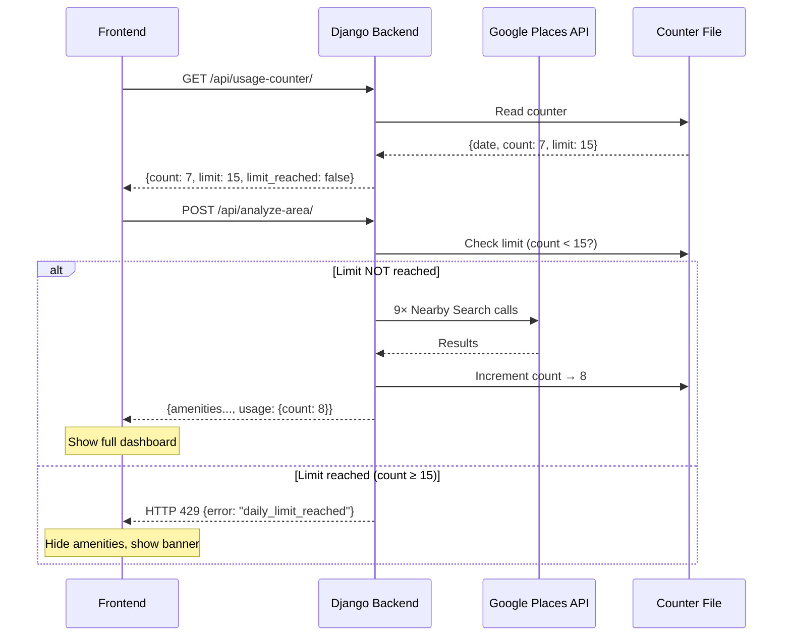

# API Usage Counter — Implementation Summary

## Overview
Daily API call counter that caps [analyze_area](file:///c:/Users/3541/Desktop/find%20your%20place/backend/mysite/places_service.py#372-391) backend calls at **15 per day**, with graceful frontend degradation when the limit is reached.

## Files Changed

### Backend (Django)

| File | Change |
|------|--------|
| [usage_counter.py](file:///c:/Users/3541/Desktop/find%20your%20place/backend/mysite/usage_counter.py) | **NEW** — JSON file-based daily counter with auto-reset at midnight |
| [api_views.py](file:///c:/Users/3541/Desktop/find%20your%20place/backend/mysite/api_views.py) | Added limit check before Google Places calls + counter increment after success + new [api_usage_counter](file:///c:/Users/3541/Desktop/find%20your%20place/backend/mysite/api_views.py#370-374) view |
| [urls.py](file:///c:/Users/3541/Desktop/find%20your%20place/backend/mysite/urls.py) | Registered `GET /api/usage-counter/` endpoint |

### Frontend (React/Vite)

| File | Change |
|------|--------|
| [areaAnalysisApi.js](file:///c:/Users/3541/Desktop/find%20your%20place/frontend/find_place/src/services/areaAnalysisApi.js) | Added [DailyLimitError](file:///c:/Users/3541/Desktop/find%20your%20place/frontend/find_place/src/services/areaAnalysisApi.js#8-15) class for HTTP 429 handling + [fetchUsageCounter()](file:///c:/Users/3541/Desktop/find%20your%20place/frontend/find_place/src/services/areaAnalysisApi.js#73-86) helper |
| [HyderabadMapPage.jsx](file:///c:/Users/3541/Desktop/find%20your%20place/frontend/find_place/src/pages/HyderabadMapPage.jsx) | Fetches counter on mount, updates after each analysis, passes `limitReached` prop, hides amenity panels when limited |
| [AreaPanel.jsx](file:///c:/Users/3541/Desktop/find%20your%20place/frontend/find_place/src/components/AreaPanel.jsx) | Accepts `limitReached` prop — hides amenity tags, shows amber info banner |
| [UsageBadge.jsx](file:///c:/Users/3541/Desktop/find%20your%20place/frontend/find_place/src/components/UsageBadge.jsx) | **NEW** — Counter pill badge with colored dot + flash animation |
| [UsageBadge.css](file:///c:/Users/3541/Desktop/find%20your%20place/frontend/find_place/src/components/UsageBadge.css) | **NEW** — Dark glassmorphism badge styling |
| [AreaPanel.css](file:///c:/Users/3541/Desktop/find%20your%20place/frontend/find_place/src/components/AreaPanel.css) | Added `.area-panel__limit-banner` styles |

### Config

| File | Change |
|------|--------|
| [.gitignore](file:///c:/Users/3541/Desktop/find%20your%20place/.gitignore) | Excluded `api_usage_counter.json` from version control |

---

## How It Works

## Behavior When Limit is Reached

| Feature | Status |
|---------|--------|
| Google Map (tiles, pan, zoom) | ✅ Works |
| Search bar (autocomplete) | ✅ Works |
| Map click + boundary rendering | ✅ Works |
| Market Pulse (price/sqft) | ✅ Works |
| Predict Price | ✅ Works |
| Browse Listings | ✅ Works |
| Demand Index | ✅ Works |
| Nearby Amenities (tags) | ❌ Hidden |
| Amenity Panel (photos/cards) | ❌ Hidden |
| Climate Card | ❌ Hidden |

## Counter Reset
The counter auto-resets at midnight (based on server date). No cron job needed — it checks the stored date on every read and resets if it's a new day.
